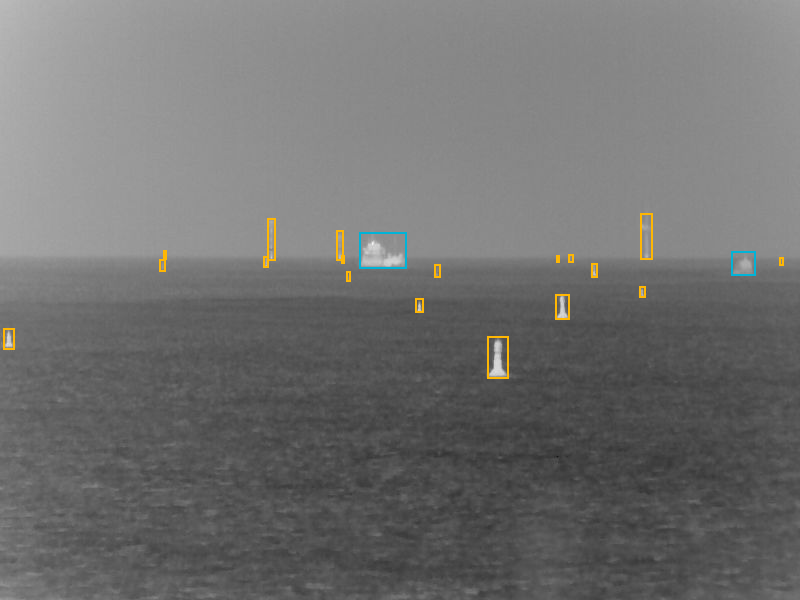

# MaCVi 2026 – Thermal Object Detection Challenge (Starter Repo)

This repository is a **ready-to-use starter kit** for the **Thermal Object Detection Challenge** of the **MaCVi 2026 workshop at CVPR 2026**.

<p align="center">
  
</p>

It provides:
- The **COCO-style dataset split files** (`instances_{train,val,test}.json`) and the expected folder layout for images.
- A **baseline MMDetection setup** (Faster R-CNN R50-FPN, COCO-pretrained).
- A **robust installation script** for **CUDA 13.0 + PyTorch 2.9.1** that builds **MMCV from source** (with CUDA ops) to avoid common compatibility pitfalls.

[Thermal Object Detection Challenge page (MaCVi 2025 @ CVPR)](https://macvi.org/workshop/cvpr/challenges/thermal_object_detection)

---

## Quick start

### 1) Create environment + install dependencies (CUDA 13.0, PyTorch 2.9.1)

**Requirements**
- Linux
- NVIDIA GPU with driver compatible with CUDA 13.0
- CUDA toolkit installed locally (`nvcc` available, e.g. `CUDA_HOME=/usr/local/cuda`)

```bash
conda create -n challenge python=3.10 -y && \
source "$(conda info --base)/etc/profile.d/conda.sh" && \
conda activate challenge && \
pip install torch==2.9.1 torchvision==0.24.1 torchaudio==2.9.1 --index-url https://download.pytorch.org/whl/cu130 && \
bash scripts/install_cuda130_torch29.sh
```

This will:
- install Python runtime dependencies from requirements.txt
- install build tooling (ninja, psutil, pybind11, etc.)
- install mmengine==0.10.7
- build and install MMCV from source (v2.1.0) with CUDA ops enabled
- install mmdet==3.3.0
- run sanity checks (imports + CUDA ops)

The installation script is intentionally verbose to handle common compatibility issues between CUDA, PyTorch, MMCV, and MMDetection on modern systems.
Advanced users may alternatively follow the official installation guides of PyTorch, MMCV, and MMDetection.

## Dataset

The challenge dataset is distributed as a GitHub Release asset (zip).
1. Download the dataset zip from the Releases section of this repository.
2. Extract it into the repository root.

After extraction, the dataset should be laid out as:

```bash
data/
  instances_train.json
  instances_val.json
  instances_test.json
  train/
    *.png
  val/
    *.png
  test/
    *.png
```

The test split contains images only (labels are withheld for evaluation).

## Repository structure

```bash
configs/                       # MMDetection configs
  _base_/                      # base runtime / model / schedule / dataset configs
  faster_rcnn/                 # experiment configs

data/                          # dataset (images + COCO annotations)
scripts/                       # installation scripts
tools/                         # training / testing entry points
requirements.txt               # Python runtime dependencies
```

## Training

Train the baseline Faster R-CNN model:

```bash
python tools/train.py configs/faster_rcnn/faster_rcnn_r50_fpn_1x_ms_cocopretrained.py
```

Training outputs (checkpoints, logs, visualizations) are written to:
```bash
work_dirs/faster_rcnn_r50_fpn_1x_ms_cocopretrained/
```

## Testing and evaluation

Evaluate a trained checkpoint on the validation or test split:
```bash
python tools/test.py \
  work_dirs/faster_rcnn_r50_fpn_1x_ms_cocopretrained/faster_rcnn_r50_fpn_1x_ms_cocopretrained.py \
  work_dirs/faster_rcnn_r50_fpn_1x_ms_cocopretrained/epoch_12.pth
```
This runs inference and COCO evaluation using the configuration in the config file.

## Export COCO predictions for submission

The provided configuration uses a CocoMetric evaluator with an output prefix:
```bash
test_evaluator = dict(
    type='CocoMetric',
    ann_file=data_root + 'instances_test.json',
    metric='bbox',
    format_only=False,
    outfile_prefix='results_test'
)
```

Running the test command will generate COCO-style prediction files such as:
```bash
results_test.bbox.json
```

This JSON file contains bounding boxes, class labels, and confidence scores, and is the file to upload to the challenge evaluation server.
Of course you are free to use any other object detection framework as long as you submit a JSON file with predictions on the testset that matches this example's format.
